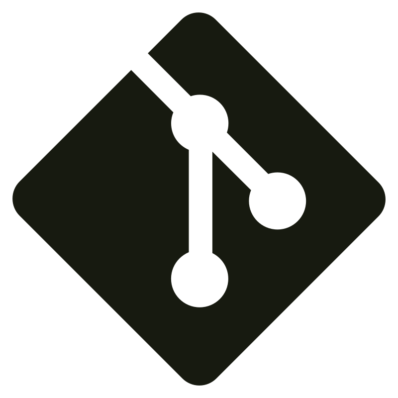
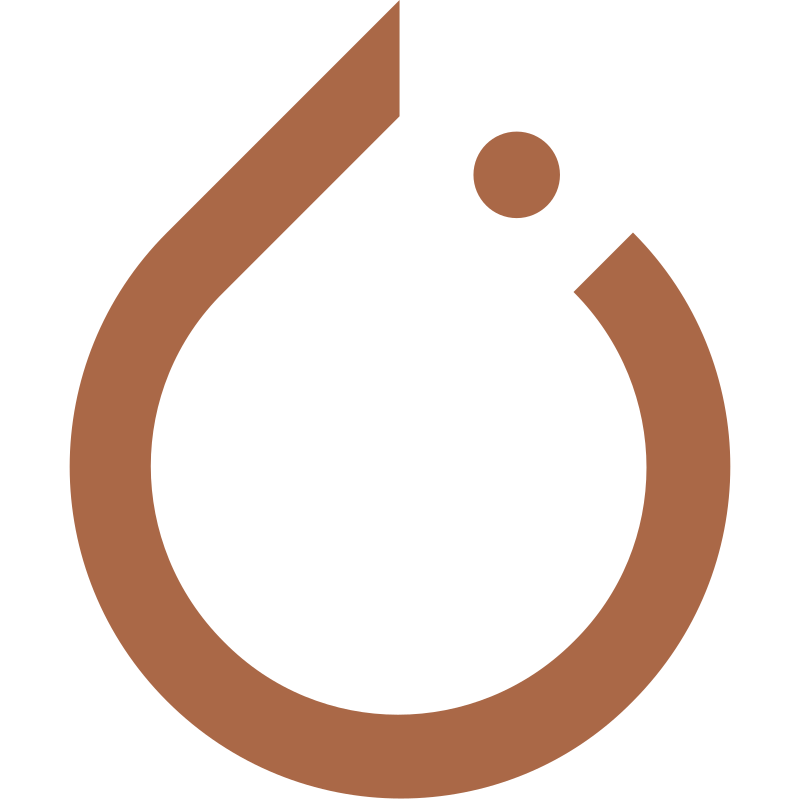
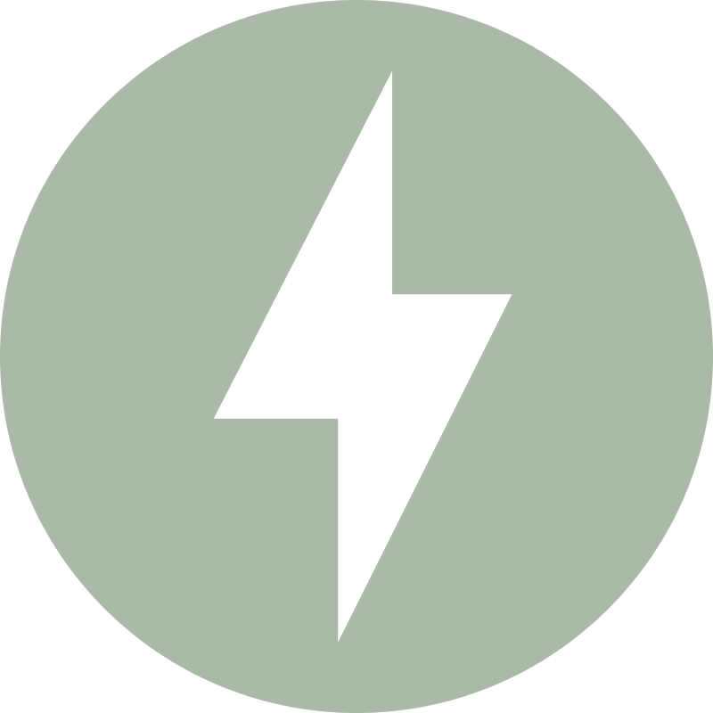
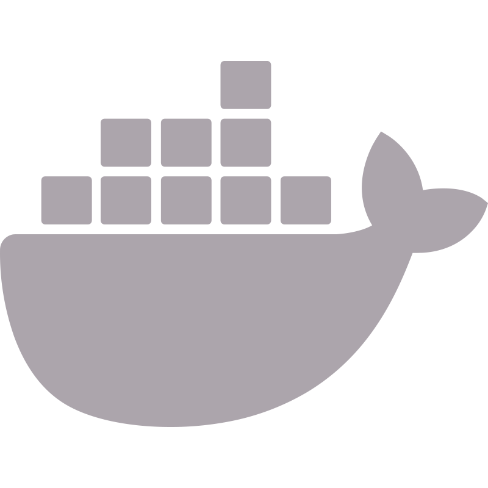
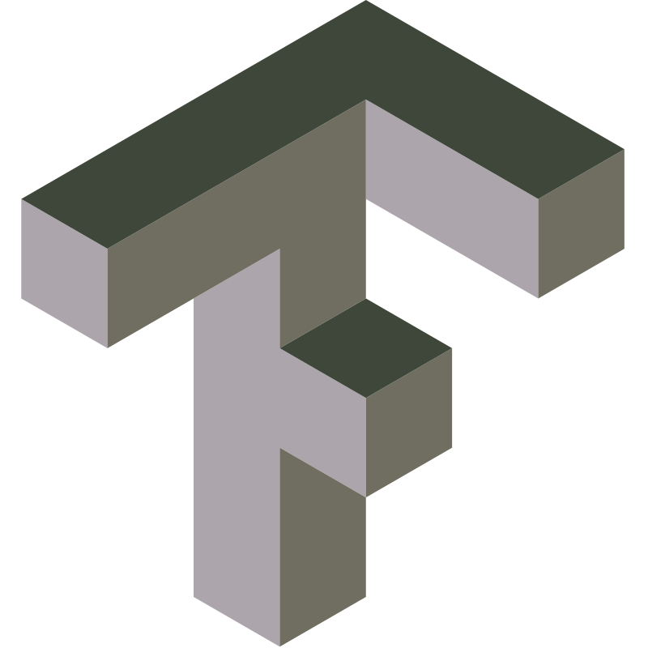

<h1 align="center">Hi 👋, I'm <a href="#" target="blank">Yesid</a></h1>
<h3 align="left">Estudiante de ciencia de datos, actualmente enfocado en Machine learning👨‍💻</h3>

    <h2 style="display: inline-block">Técnologias que utilizo</h2>

<table style="border: none">
  <tr>
    <td align="center" width="96" style="border: none">
      
       Python
    </td>
    <td align="center" width="96" style="border: none">
      
       Linux
    </td>
    <td align="center" width="96" style="border: none">
      
       Git
    </td>
    <td align="center" width="96" style="border: none">
      
       Bash
    </td>
    <td align="center" width="96" style="border: none">
      
       Sklearn
    </td>
    <td align="center" width="96" style="border: none"> 
      
       Postgresql
    </td>
    <td align="center"  width="96" style="border: none">
      
       Pytorch
    </td>
    <td align="center" width="96" style="border: none">
      
       Fastapi
    </td>
    <td align="center" width="96" style="border: none">
      
       Docker
    </td>
    <td align="center" width="96" style="border: none">
      
       TensorFlow
    </td>
  </tr>
</table>

